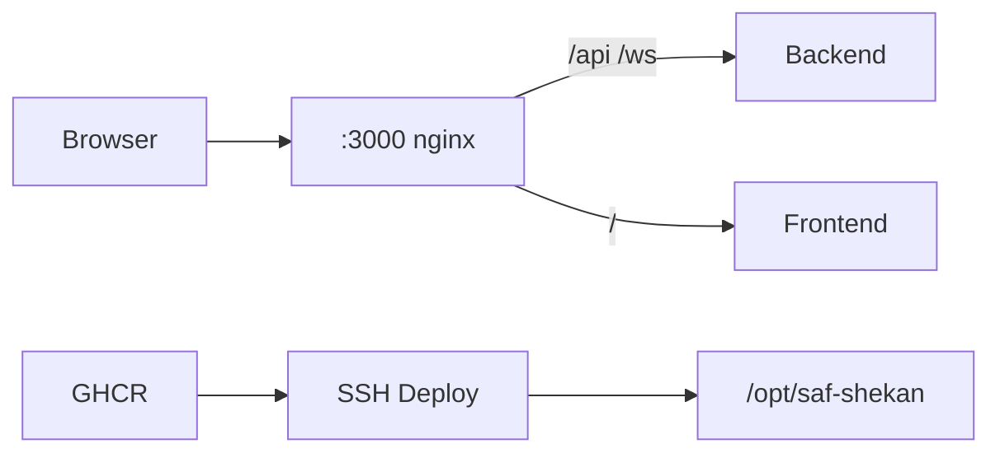

# راهنمای استقرار و پایپ‌لاین CI/CD صف‌شکن (SafShekan)

پروژه **صف‌شکن** مجهز به پایپ‌لاین CI/CD خودکار بر بستر **GitHub Actions**، **GitHub Container Registry (GHCR)**، **Docker Compose** و **nginx** به‌عنوان gateway عمومی است.

---

## معماری استقرار



| لایه | نقش |
|------|-----|
| **nginx** | تنها پورت عمومی `:3000` — پروکسی `/api` و `/ws` به backend، `/` به frontend |
| **backend** | NestJS engine (فقط داخل Docker network) |
| **frontend** | Next.js dashboard (فقط داخل Docker network) |

> نکته: Next.js `rewrites` برای WebSocket قابل‌اعتماد نیست؛ به همین دلیل nginx gateway اجباری است.

---

## مشخصات سرور و پورت‌ها

- **آدرس سرور:** `5.159.49.36`
- **پورت عمومی (nginx → frontend + پروکسی API/WS):** `https://5.159.49.36:3000`
- **مستندات Swagger:** `https://5.159.49.36:3000/api/docs`
- **Health Check:** `https://5.159.49.36:3000/api/health`
- گواهی روی پورت عمومی خودامضا است (هشدار مرورگر یک‌بار). HTTP روی این پورت CSS و JS را در مسیر با صفحهٔ فیلتر عوض می‌کند؛ TLS جلوی آن را می‌گیرد.
- **مسیر پروژه در سرور:** `/opt/saf-shekan`
- پورت قدیمی `3880` دیگر استفاده نمی‌شود (همه از پشت nginx روی `:3000`).

---

## تنظیم Secretهای گیت‌هاب

مسیر: **Settings → Secrets and variables → Actions**

| نام Secret | مقدار | الزامی |
|---|---|---|
| `SSH_HOST` | `5.159.49.36` | اگر خالی باشد همین آدرس استفاده می‌شود |
| `SSH_USER` | `root` | اگر خالی باشد `root` استفاده می‌شود |
| `SSH_PRIVATE_KEY` | محتوای کلید خصوصی Ed25519 | بله |
| `GHCR_PULL_TOKEN` | PAT با scope `read:packages` | خیر؛ ایمیج‌های GHCR عمومی هستند و فقط وقتی ست باشد `docker login` اجرا می‌شود |

### کلید SSH Deploy

کلید خصوصی محلی:

```text
~/.ssh/id_ed25519_safshekan
```

کلید عمومی باید در `/root/.ssh/authorized_keys` سرور باشد. Environment به نام `production` در GitHub (برای job deploy) در صورت نیاز از Settings → Environments ساخته شود.

---

## روش‌های استقرار

### ۱. GitHub Actions (پیشنهادی)

فایل: `.github/workflows/ci-cd.yml`

با هر push به `main`/`master` یا `workflow_dispatch`:

1. **validate** — lint + test + build
2. **build-backend / build-frontend** — build & push به GHCR
3. **deploy** — sync `docker-compose.yml` + `docker/nginx.conf`، pull ایمیج‌ها، `compose up`، health check روی `:3000`

ایمیج‌ها:

- `ghcr.io/<owner>/safshecan-backend:<sha>` / `:latest`
- `ghcr.io/<owner>/safshecan-frontend:<sha>` / `:latest`

### ۲. استقرار مستقیم از لوکال

```bash
pnpm run deploy:remote
```

احراز هویت: `SSH_PRIVATE_KEY` یا فایل `~/.ssh/id_ed25519_safshekan` (اختیاری: `SSH_PASSWORD` از env — هرگز در کد هاردکد نشود).

این دستور سورس را آپلود می‌کند، ایمیج‌ها را روی سرور build می‌کند، nginx gateway را بالا می‌آورد و health را چک می‌کند.

### ۳. مدیریت روی سرور

```bash
ssh root@5.159.49.36
cd /opt/saf-shekan
docker compose ps
docker compose logs -f
curl -kf https://127.0.0.1:3000/api/health
```

---

## پایداری کانفیگ

```text
/opt/saf-shekan/config.json
```

این فایل به `apps/backend/config.json` داخل کانتینر mount می‌شود و بین دیپلوی‌ها حفظ می‌ماند. در گیت نیست؛ شکل بدون راز در `apps/backend/config.example.json` است. کش نماد در `apps/backend/data` است. `GET /api/status` کوکی و `Authorization` را برنمی‌گرداند.

---

## Smoke test بعد از دیپلوی

```bash
curl -kf https://5.159.49.36:3000/api/health   # باید JSON status=ok برگرداند
curl -kf https://5.159.49.36:3000/              # داشبورد
# در مرورگر: ساعت اتمی باید از 00:00:00 خارج شود و WS وصل باشد
```
