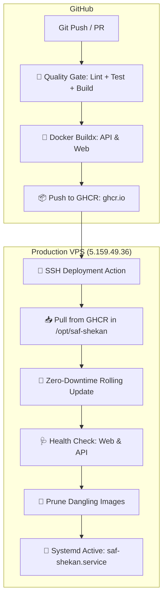

# 🚀 راهنمای استقرار و پایپ‌لاین CI/CD صف‌شکن (SafShekan)

پروژه **صف‌شکن** مجهز به یک پایپ‌لاین CI/CD کاملاً خودکار، امن، Enterprise و بدون Downtime بر بستر **GitHub Actions**، **GitHub Container Registry (GHCR)** و **Docker Compose** است.

---

## 🏗 معماری استقرار (CI/CD Architecture)



---

## 🌐 مشخصات سرور و پورت‌ها

- **آدرس سرور:** `5.159.49.36`
- **پورت داشبورد وب:** `http://5.159.49.36:3000`
- **پورت ای‌پی‌آی و وب‌سوکت:** `http://5.159.49.36:3880`
- **مستندات تعاملی Swagger:** `http://5.159.49.36:3880/api/docs`
- **بررسی سلامت API (Health Check):** `http://5.159.49.36:3880/api/health`
- **مسیر پروژه در سرور:** `/opt/saf-shekan`

---

## 🔑 تنظیم Secretهای گیت‌هاب (GitHub Secrets)

برای فعال‌سازی کامل فرآیند استقرار خودکار پس از هر `git push` به شاخه `main` یا `master`، به بخش **Settings > Secrets and variables > Actions** در ریپازیتوری گیت‌هاب خود رفته و مقادیر زیر را وارد کنید:

| نام Secret | مقدار پیشنهادی | توضیحات |
|---|---|---|
| `SSH_HOST` | `5.159.49.36` | آی‌پی سرور پروداکشن |
| `SSH_USER` | `root` | نام کاربری سرور |
| `SSH_PRIVATE_KEY` | *(کلید خصوصی ایجاد شده در زیر)* | کلید اختصاصی Ed25519 که در سرور Authorize شده است |
| `GHCR_PULL_TOKEN` | *(اختیاری)* | توکن دسترسی خواندن ایمیج‌ها (در صورتی که ایمیج Private باشد) |

### 🔐 کلید اختصاصی SSH Deploy Key:

کلید خصوصی اختصاصی بر روی سیستم شما در مسیر زیر ذخیره شده است و باید محتوای آن در بخش Secrets گیت‌هاب قرار گیرد:

```text
~/.ssh/id_ed25519_safshekan
```

کلید عمومی متناظر آن نیز با موفقیت در فایل `/root/.ssh/authorized_keys` سرور قرار گرفته است.

---

## ⚡ روش‌های استقرار (Deployment Methods)

### ۱. استقرار خودکار با GitHub Actions (پیشنهادی)
با هر پوش به ریپازیتوری، پایپ‌لاین `.github/workflows/ci-cd.yml` به صورت خودکار:
1. تمام تست‌ها، لنت‌ها و بیلد مونو‌ریپو را اعتبارسنجی می‌کند.
2. ایمیج‌های داکر `@saf-shekan/api` و `@saf-shekan/web` را در GHCR می‌سازد و کش لایه‌ها را بهینه‌سازی می‌کند.
3. از طریق SSH به سرور متصل شده، ایمیج‌های جدید را پول و کانتینرها را بدون قطعی ری‌استارت می‌کند.
4. سلامت سرویس‌ها را با تست زنده پایش کرده و گزارش خلاصه ارسال می‌نماید.

---

### ۲. استقرار با یک دستور از سیستم شخصی (Direct CLI Deploy)
شما می‌توانید در هر لحظه مستقیماً از ترمینال لوکال خود پروژه را بیلد و روی سرور مستقر کنید:

```bash
pnpm run deploy:remote
```

این دستور به صورت خودکار:
- سورس‌کد را فشرده و به سرور منتقل می‌کند.
- ایمیج‌های داکر را در سرور کامپایل می‌نماید.
- کانتینرها را ری‌استارت کرده و وضعیت سلامت را بررسی می‌کند.

---

### ۳. مدیریت مستقیم روی سرور (Server Management)

اگر وارد سرور شدید (`ssh root@5.159.49.36`):

```bash
# رفتن به پوشه پروژه
cd /opt/saf-shekan

# اجرای اسکریپت استقرار سریع
./deploy.sh

# بررسی سلامت سرویس‌ها
./healthcheck.sh

# مشاهده لاگ‌های زنده
docker compose logs -f

# وضعیت سرویس خودکار سیستم‌دی
systemctl status saf-shekan.service
```

---

## 🛡 تنظیمات پایدار و کانفیگ (Persistence)

تنظیمات ربات، توکن‌های کارگزاری، نماد هدف و تنظیمات سرخطی در فایل زیر نگهداری می‌شوند و هنگام ری‌استارت یا دیپلوی کانتینرها پایدار می‌مانند:

```text
/opt/saf-shekan/config.json
```
همچنین سرویس به گونه‌ای تنظیم شده که با ریبوت سرور از طریق `saf-shekan.service` به صورت خودکار مجدداً راه‌اندازی شود.
